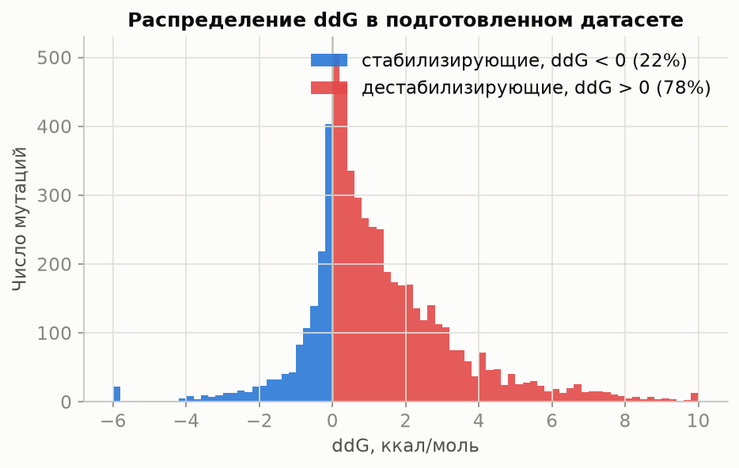
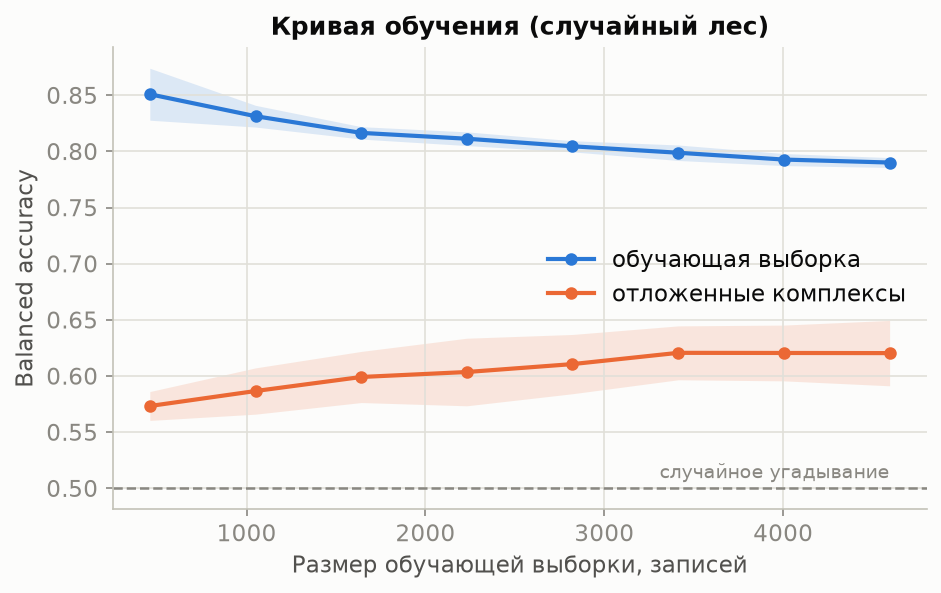
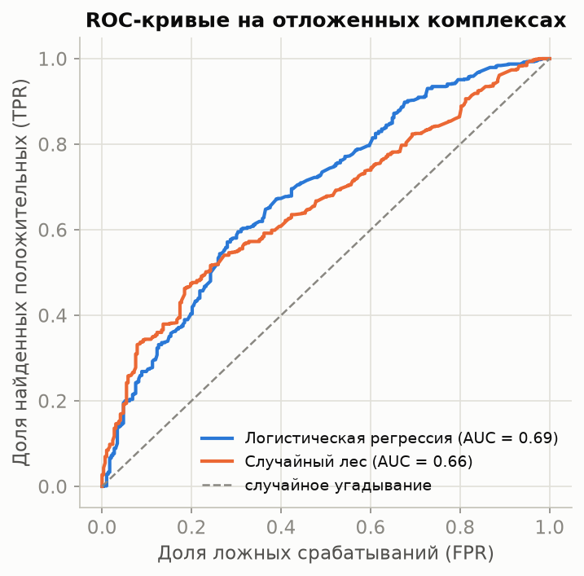
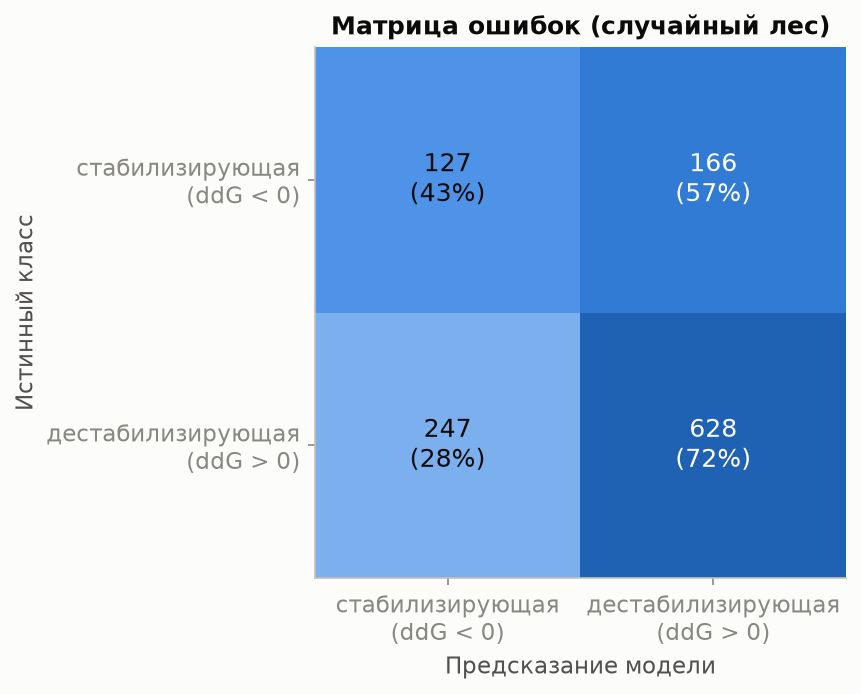
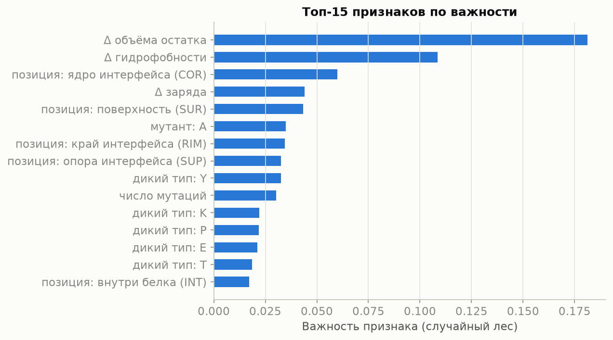

# Предсказание знака ddG по данным SKEMPI 2.0

Тестовое задание: обучить простую модель, которая предсказывает знак изменения
свободной энергии связывания (ddG) при мутациях в белок-белковых комплексах,
и показать, что она действительно обучается. Ниже описываю, что я делала и
почему, остальные детали — в комментариях в коде.

## Задача

Прочность связывания двух белков описывается свободной энергией связывания ΔG:
чем она ниже, тем прочнее комплекс. Мутация эту энергию сдвигает, и
ddG = ΔG(мутант) − ΔG(дикий тип). Если ddG > 0, мутация связывание ослабила
(дестабилизирующая), если ddG < 0 — усилила (стабилизирующая). Предсказать
нужно только знак, так что по сути это обычная бинарная классификация.

## Данные

[SKEMPI 2.0](https://life.bsc.es/pid/skempi2) — база экспериментальных
измерений аффинности для комплексов с известной структурой, 7085 записей вида
«комплекс, мутации, Kd дикого типа и мутанта». Готовой колонки ddG в базе нет,
я считала её из констант диссоциации: ΔG = R·T·ln(Kd), откуда
ddG = R·T·ln(Kd_mut / Kd_wt), в ккал/моль. Температуру брала из записи, а где
она не указана — 298 K.

Дальше чистка. Записи без измеренной аффинности пришлось выбросить, ddG для
них просто не посчитать (осталось 6798). Потом я заметила, что одна и та же
мутация нередко измерена в нескольких статьях — такие дубликаты свернула в
одну запись с медианным ddG, иначе одинаковые примеры разъехались бы по train
и test и завысили оценку (осталось 5914). Ещё у полутора сотен записей ddG
вышел ровно 0, знак у нуля не определён, их тоже убрала.

Итого 5763 записи из 341 комплекса. Классы заметно несбалансированы: 78%
мутаций дестабилизирующие. Это ожидаемо (сломать связывание проще, чем
улучшить, да и аланиновых сканов в базе много), но дисбаланс придётся
учитывать — и в моделях, и в выборе метрик.

## Признаки

Со структурами PDB я решила не связываться: задание просит показать
обучаемость, а не выжать максимум качества. Поэтому все 49 признаков
извлекаются прямо из таблицы:

- какая аминокислота на какую меняется — счётчики по 20 аминокислотам для
  дикого типа и мутанта;
- сдвиги физико-химических свойств «мутант минус дикий тип»: гидрофобность по
  Кайту—Дулиттлу, объём остатка, формальный заряд;
- положение мутации относительно интерфейса из разметки SKEMPI (COR — ядро
  интерфейса, SUP — опора, RIM — край, INT — внутри белка, SUR — поверхность).
  Логика простая: мутация в ядре интерфейса должна бить по связыванию сильнее,
  чем где-то на поверхности;
- число мутаций в записи.

Записи с несколькими мутациями не выбрасывала — счётчики и сдвиги по ним
просто суммируются.

## Как я проверяла, что модель учится честно

Это, по-моему, самое важное решение в задании. У одного комплекса в SKEMPI
бывают сотни мутаций, и если разбить данные на train/test случайно, мутации
одного и того же комплекса окажутся по обе стороны. Модель тогда может просто
запомнить комплекс, и оценка получится завышенной — известная ловушка в
задачах с белками.

Поэтому валидация у меня — 5-кратный GroupKFold с группировкой по
PDB-комплексу: все мутации комплекса целиком уходят либо в train, либо в
test, и модель всегда проверяется на комплексах, которых не видела. Склейка
дубликатов медианой (выше) работает на ту же цель.

## Модели и результаты

Взяла три модели по нарастанию сложности: baseline, который всегда отвечает
самым частым классом, логистическую регрессию со стандартизацией признаков и
`class_weight="balanced"`, и случайный лес. Baseline здесь нужен как планка:
из-за дисбаланса его accuracy уже 0.78, поэтому смотреть только на accuracy
нельзя — я ориентировалась на balanced accuracy и ROC-AUC.

Метрики по кросс-валидации, среднее ± отклонение по фолдам (таблица также в
[results/metrics.md](results/metrics.md)):

| Модель | Accuracy | Balanced accuracy | F1 | ROC-AUC |
|---|---|---|---|---|
| Baseline (частый класс) | 0.779 ± 0.022 | 0.500 ± 0.000 | 0.876 ± 0.014 | 0.500 ± 0.000 |
| Логистическая регрессия | 0.624 ± 0.027 | 0.609 ± 0.019 | 0.724 ± 0.028 | 0.664 ± 0.027 |
| Случайный лес | 0.695 ± 0.022 | 0.616 ± 0.017 | 0.794 ± 0.020 | 0.685 ± 0.017 |

У baseline balanced accuracy и ROC-AUC ровно 0.5 — классы он не различает
вообще. Обе настоящие модели на незнакомых комплексах дают заметно больше
0.5, то есть выучивают что-то обобщаемое, а не запоминают данные.

Кривая обучения показывает то же самое нагляднее: качество на отложенных
комплексах растёт с объёмом обучающей выборки, а разрыв между train и
validation постепенно сокращается.

ROC-кривые и матрица ошибок на отложенных 20% комплексов:

Приятно, что важности признаков у леса вышли осмысленными: сильнее всего
влияют изменение объёма остатка, изменение гидрофобности и попадание мутации
в ядро интерфейса. С интуицией это сходится — замена крупного гидрофобного
остатка в ядре интерфейса на маленький (классический аланиновый скан) чаще
всего рушит связывание.

Метрики и графики уже закоммичены в `results/`, так что результаты видно
прямо в репозитории без запуска.
